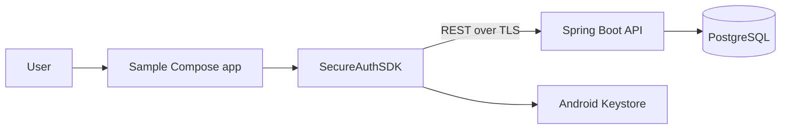

# Secure Mobile Authentication SDK

## Overview

SecureAuthSDK is a reusable Android authentication library, a Material 3 sample client, and a Kotlin/Spring Boot reference server. It demonstrates an end-to-end registration, OTP, JWT, refresh rotation, logout, secure local storage, and biometric-unlock boundary without claiming integration with a real identity provider.

## Business Problem

Apps repeatedly rebuild sensitive authentication code and drift into inconsistent token storage, refresh, error, and logout behavior. An SDK gives client teams one versioned contract and concentrates security review.

## Why an SDK?

The host app calls a narrow coroutine API and observes `StateFlow`; Retrofit, token envelopes, refresh coordination, platform biometric callbacks, and server errors remain internal. This is reusable across multiple Android applications and independently distributable.

## Key Features

- Registration and password login followed by expiring, attempt-limited, one-use six-digit OTP challenges
- Five-minute signed JWT access tokens and opaque refresh-token hashing, rotation, expiry, and revocation
- AES-GCM token envelope protected by a non-exportable Android Keystore key
- `BiometricPrompt` abstraction with unavailable, enrollment, cancellation, and lockout results
- Immutable public models, closed result types, observable session state, request IDs, safe error mapping
- Kotlin/Spring Boot API, PostgreSQL/Flyway schema, validation, BCrypt, local rate limiting, Swagger
- Android/backend CI, unit/integration tests, Docker Compose, HLD/LLD/STRIDE/ADR documentation

## Architecture



## SDK Architecture

`Public API → session/use-case orchestration → Retrofit repository boundary → REST API`, with a parallel `TokenStorage → AES-GCM → Android Keystore` boundary. See [HLD](docs/HLD.md) and [LLD](docs/LLD.md).

## Authentication Flow

Login and registration return an OTP challenge rather than tokens. Successful OTP verification consumes the challenge, activates registration where applicable, and issues the first token pair. The app reacts to `OtpRequired` and `Authenticated` states.

## Token Lifecycle

Access JWTs live five minutes. Refresh tokens are random opaque values; only SHA-256 hashes are persisted server-side. Refresh use revokes the old token and returns a replacement. The SDK mutex makes refresh single-flight for cooperating callers and prevents parallel rotation. Failure clears/ends the session; logout clears local material before best-effort server revocation.

## Biometric Flow

The SDK delegates authentication to the OS. It receives only success/error callbacks—never fingerprints, face images, or templates. Biometric success may unlock an existing encrypted local session under host policy; it does not create server authentication.

## Security Architecture

Passwords and OTPs use BCrypt. JWT signatures and expiry are validated. Sensitive input and tokens are not logged. OTPs have expiry, maximum attempts, cooldown, and one-use semantics. Request IDs support diagnosis without secrets. Keystore hardware backing is used when a device provides it but is not guaranteed. Development OTP logging is explicit and must be disabled outside local development. TLS termination is required in deployment.

## Technology Stack

Kotlin, Android SDK 35/min 26, Jetpack Compose/Material 3, Coroutines/StateFlow, Retrofit/OkHttp, Kotlin Serialization, Android Keystore, BiometricPrompt, Gradle Kotlin DSL, JUnit/MockWebServer; Spring Boot 3, Spring Security, JPA, Flyway, PostgreSQL, JWT, OpenAPI, Docker.

## Repository Structure

```text
android-sdk/secureauth     public API, network/session/security/storage
android-sdk/secureauth-ui  optional Compose components
sample-app                 SDK consumer application
backend                    Spring Boot authentication server
docs                       architecture, API, data, security, testing
.github/workflows          Android and backend CI
```

## Example SDK Integration

```kotlin
val auth = SecureAuth.initialize(
    applicationContext,
    SecureAuthConfiguration("https://auth.example.com/")
)

lifecycleScope.launch {
    when (val result = auth.login(email, password)) {
        is AuthResult.OtpRequired -> navigator.openOtp(result.challengeId)
        AuthResult.InvalidCredentials -> showInvalidCredentials()
        else -> showAuthError(result)
    }
}
```

Publish locally with `./gradlew :android-sdk:secureauth:publishToMavenLocal`, then consume `implementation("com.srichaitanya.secureauth:secureauth:1.0.0")`. Versions follow SemVer; breaking public API changes increment the major version. Consumer keep rules ship in the AAR.

## Backend, Android, Docker, and Running

Requirements: JDK 17, Android Studio with SDK 35 for Android, and Docker for the complete local stack.

```bash
cp .env.example .env
docker compose up --build
curl http://localhost:8080/api/health
```

Open the repository in Android Studio, sync, select `sample-app`, and run an API 26+ emulator. The sample uses `http://10.0.2.2:8080/` only for local emulator development. For direct backend development:

```bash
cd backend
./gradlew bootRun
```

The development OTP appears in backend logs only while `OTP_DEVELOPMENT_MODE=true`.

## Testing

```bash
./gradlew build test lint
cd backend && ./gradlew test build
```

`connectedCheck` additionally requires a running emulator/device. See [Testing](docs/TESTING.md). Never infer passing status from these instructions; the completion report records what actually ran.

## Engineering Documents

- [API](docs/API.md) and live Swagger at `/swagger-ui/index.html`
- [SDK usage](docs/SDK_USAGE.md)
- [HLD](docs/HLD.md), [LLD](docs/LLD.md), and [System design](docs/SYSTEM_DESIGN.md)
- [Threat model](docs/THREAT_MODEL.md), [ADRs](docs/ADR.md), and [Database](docs/DATABASE.md)
- [Testing](docs/TESTING.md) and [Performance](docs/PERFORMANCE.md)

## Design Trade-offs and Failure Scenarios

Local fixed-window throttling is transparent and dependency-free but neither durable nor distributed. JWT access avoids a database read per request but cannot be instantly revoked; its short lifetime bounds that window. A corrupted token envelope is deleted. Offline login never succeeds. Expired/revoked refresh forces login. Concurrent refresh is serialized. Logout clears the device first even if revocation cannot reach the server. Network timeouts and HTTP 429/5xx become typed retryable/non-retryable results. Device/app restart reloads only an encrypted session envelope.

## Performance Considerations

BCrypt deliberately consumes CPU; database indexes serve email/token ownership lookups; short JWT validation is local. No measurements are fabricated—see [Performance](docs/PERFORMANCE.md) for the reproducible plan and current limitation.

## Security Limitations

This portfolio server has no SMS/email provider, device attestation, certificate pinning, KMS/HSM, distributed replay detection, immutable audit export, or compromised-host defense. A malicious host app can inspect values it passes to an in-process SDK. Local cleartext traffic is enabled only for emulator demonstration. Keystore hardware security varies. The current audit schema is ready for events, but production-grade durable event emission is not complete.

## Production Evolution

Use an API gateway, TLS everywhere, Redis-backed atomic throttling, managed PostgreSQL, queue-based OTP delivery/audit, observability, signing-key rotation/JWKS, secret management, refresh-token family replay detection, multi-region recovery, and formal security testing. See [System design](docs/SYSTEM_DESIGN.md).

## Screenshots

Screenshots are intentionally omitted until captured from a verified emulator build.

## Interview Questions

1. Why build an SDK instead of embedding auth in an app, and how does the public contract constrain misuse?
2. Why Kotlin, MVVM-style state, and Clean Architecture boundaries?
3. How does refresh rotation work, and how does the mutex prevent refresh storms or loops?
4. Why Android Keystore, what is actually hardware-backed, and what happens on corruption/logout?
5. How does `BiometricPrompt` work without the SDK receiving biometric data?
6. How are OTP expiry, one-use, attempts, resend cooldown, and enumeration handled?
7. How would Redis and an API gateway scale throttling?
8. How is the AAR distributed and versioned?
9. How are refresh tokens revoked and how would token-family replay detection improve this?
10. What happens offline or if a malicious consumer misuses the SDK?
11. What changes are required before production hardening?

## Resume Description

- Built a reusable Kotlin Android authentication SDK exposing coroutine result types and reactive `StateFlow` session states, with a Material 3 integration app.
- Implemented Android Keystore-backed AES-GCM token storage and an OS `BiometricPrompt` abstraction without accessing biometric data.
- Developed a Spring Boot/PostgreSQL authentication API with BCrypt credentials/OTPs, signed short-lived JWTs, rotating hashed refresh tokens, validation, and throttling.
- Added Docker Compose, Flyway schema management, Android/backend CI, automated tests, and HLD/LLD/STRIDE/API documentation for the end-to-end system.
