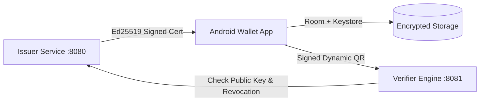

# Secure Digital Certificate Wallet

[](https://github.com/SriChaitanya1824/Secure-Digital-Certificate-Wallet/actions/workflows/android.yml)
[](https://github.com/SriChaitanya1824/Secure-Digital-Certificate-Wallet/actions/workflows/backend.yml)

A production-style, privacy-preserving Android Digital Certificate Wallet and Verification Platform designed for digital identity, verifiable credentials, and Certificate Authority engineering.

Targeted for the Android Developer role at **VIDA** (Certificate Authority & Digital Identity).

---

## 1. Overview & Trust Model

The **Secure Digital Certificate Wallet** allows users to securely receive, store, selectively disclose, and present digitally signed credentials (university degrees, employment certificates, training licenses). Verifiers can scan presentation QR codes to cryptographically verify signatures, check non-expiration, validate live revocation status, and prevent replay attacks.

> [!IMPORTANT]
> **Trust Model Disclosure**: This repository is a standalone portfolio sandbox implementation. It does NOT connect to real government databases or production VIDA CA infrastructure. It implements a complete local trust environment with an **Issuer Authority**, **Holder Mobile Wallet**, and **Relying Party Verifier**.

---

## 2. Key Features

- **Ed25519 Asymmetric Cryptography**: Tamper-proof digital signing and verification.
- **Privacy-Preserving Selective Disclosure**: Holder chooses exactly which claims to reveal in QR presentations.
- **QR Replay Protection**: Dynamic single-use nonces and presentation timestamps.
- **Offline-First Android Wallet**: Room database cache with automatic delta synchronization.
- **Hardware-Backed Security**: Android Keystore AES-256-GCM encryption and `BiometricPrompt` protection.
- **Complete Certificate Lifecycle**: Active, Expired, Revoked, and Suspended states with idempotent revocation.
- **Microservice Backend**: Spring Boot 3 Kotlin services for Issuer and Verifier with PostgreSQL & Flyway.

---

## 3. Architecture



---

## 4. Repository Structure

```text
/
  android/
    app/                      # Application root, Navigation & Hilt DI
    core/                     # Domain models, Result types & UseCases
    core-security/            # Keystore AES-256-GCM, Biometrics, Ed25519
    core-network/             # Retrofit, OkHttp, API services
    core-database/            # Room Database, DAOs, Entities
    core-ui/                  # Material 3 Theme & UI Components
    feature-auth/             # Login & Registration screens
    feature-wallet/           # Dashboard, Certificate List & Detail
    feature-certificate/      # Selective disclosure & QR presentation
    feature-scanner/          # CameraX QR Scanner analyzer
    feature-verification/     # Verification result & audit trail
    feature-profile/          # Security settings & profile
  issuer-backend/             # Spring Boot Issuer & CA service (:8080)
  verifier-backend/           # Spring Boot Verifier service (:8081)
  docs/                       # Architecture, Security, Threat Model & ADRs
  docker-compose.yml          # Local PostgreSQL & microservice setup
```

---

## 5. Getting Started & Running

### Prerequisites
- JDK 17+
- Android Studio Ladybug / Meerkat (API 26+)
- Docker & Docker Compose

### 1. Launch Backends with Docker Compose
```bash
cp .env.example .env
docker compose up --build
```

### 2. Verify Backend Endpoints
- Issuer Swagger UI: `http://localhost:8080/swagger-ui.html`
- Verifier Swagger UI: `http://localhost:8081/swagger-ui.html`

### 3. Run Automated Tests
```bash
# Test Issuer and Verifier Backends
./gradlew :issuer-backend:test :verifier-backend:test
```

---

## 6. Seeded Demo Data

- **Issuer**: `VIT Academic Credentials` (`did:vid:issuer:vit-university`)
- **Active Certificate**: Bachelor of Technology Degree (`cert-vit-btech-2026-001`)
- **Expired Certificate**: Software Engineering Training Certificate (`cert-vit-training-2023-002`)
- **Revoked Certificate**: Employment Certificate (`cert-vit-intern-2025-003`)
- **Suspended Certificate**: Professional License (`cert-vit-cloud-2025-004`)

---

## 7. Resume Bullets

- Architected an offline-first Android Digital Certificate Wallet using **Kotlin, Jetpack Compose, Material 3, Clean Architecture, and Hilt**, supporting cryptographic credential storage, selective disclosure, and dynamic QR presentations.
- Implemented **Android Keystore AES-256-GCM** hardware-backed encryption and **BiometricPrompt** authentication to protect sensitive credential claims from local extraction.
- Developed a high-performance **Ed25519 cryptographic signing and verification engine** with deterministic canonical JSON serialization, single-use replay protection nonces, and timestamp validation.
- Built **Spring Boot 3 Kotlin microservices** with PostgreSQL, Flyway migrations, JWT authentication, and idempotent certificate revocation for end-to-end credential lifecycle management.
