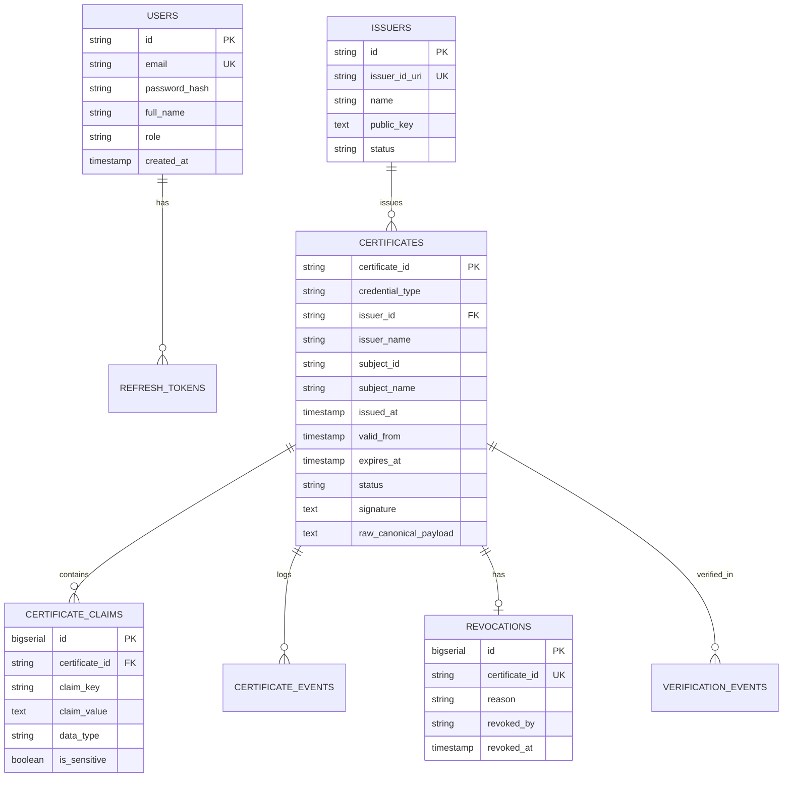

# Database Schema & Data Models

## PostgreSQL Tables & Relationships

```mermaid
erDiagram
    USERS ||--o{ REFRESH_TOKENS : has
    ISSUERS ||--o{ CERTIFICATES : issues
    CERTIFICATES ||--o{ CERTIFICATE_CLAIMS : contains
    CERTIFICATES ||--o{ CERTIFICATE_EVENTS : logs
    CERTIFICATES ||--o| REVOCATIONS : has
    CERTIFICATES ||--o{ VERIFICATION_EVENTS : verified_in

    USERS {
        string id PK
        string email UK
        string password_hash
        string full_name
        string role
        timestamp created_at
    }

    ISSUERS {
        string id PK
        string issuer_id_uri UK
        string name
        text public_key
        string status
    }

    CERTIFICATES {
        string certificate_id PK
        string credential_type
        string issuer_id FK
        string issuer_name
        string subject_id
        string subject_name
        timestamp issued_at
        timestamp valid_from
        timestamp expires_at
        string status
        text signature
        text raw_canonical_payload
    }

    CERTIFICATE_CLAIMS {
        bigserial id PK
        string certificate_id FK
        string claim_key
        text claim_value
        string data_type
        boolean is_sensitive
    }

    REVOCATIONS {
        bigserial id PK
        string certificate_id UK
        string reason
        string revoked_by
        timestamp revoked_at
    }
```
