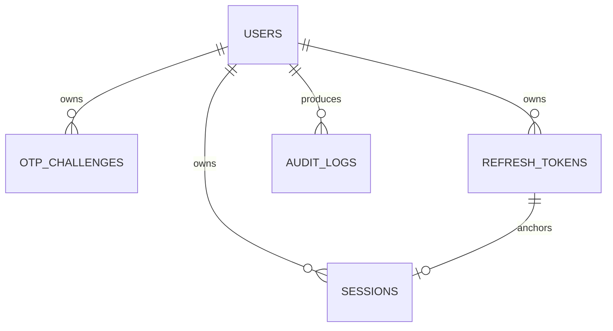

# Database

`users` has a UUID primary key and unique normalized email; password hashes are BCrypt. `otp_challenges` references a user, records purpose, BCrypt OTP hash, expiry, attempts, maximum, and consumption time. `refresh_tokens` stores a unique SHA-256 token hash, expiry, revocation, and rotation link. `sessions` models status and last activity for production evolution. `audit_logs` records event metadata without credentials or tokens.

Foreign keys protect ownership. User/time lookup columns are indexed. An OTP moves from active to consumed or expired; it cannot be reused. A refresh token moves from active to revoked and may point to its replacement. Cleanup jobs for expired rows are a production concern.
