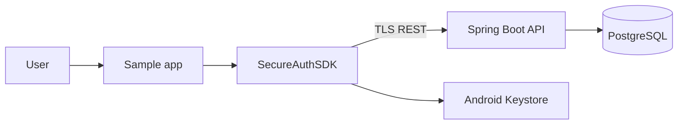
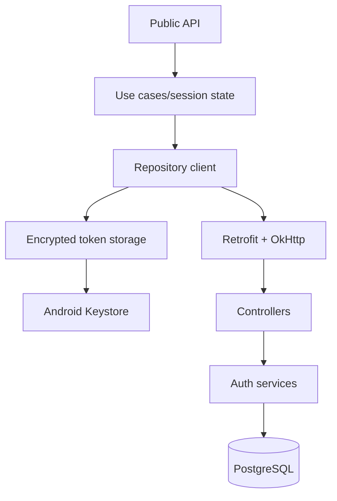
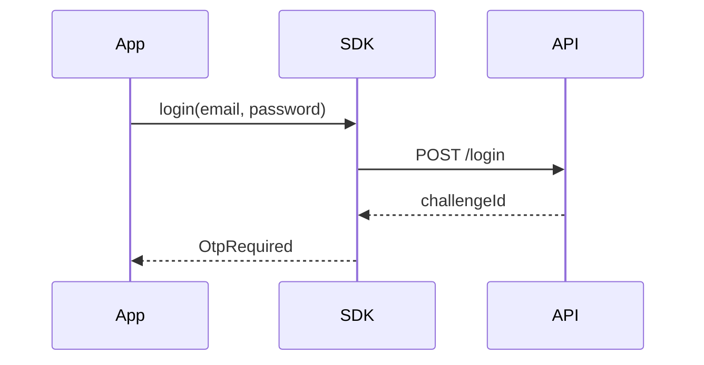
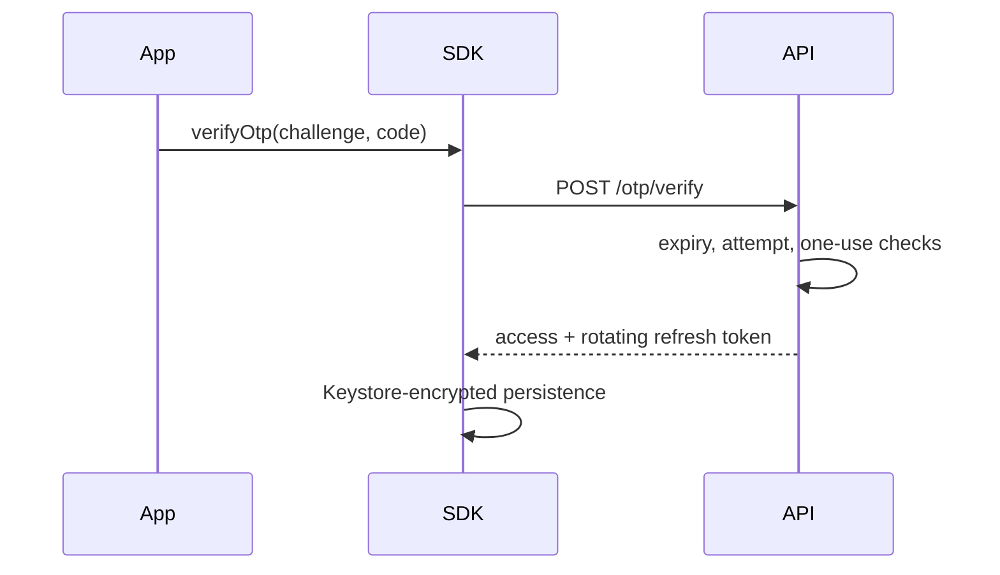
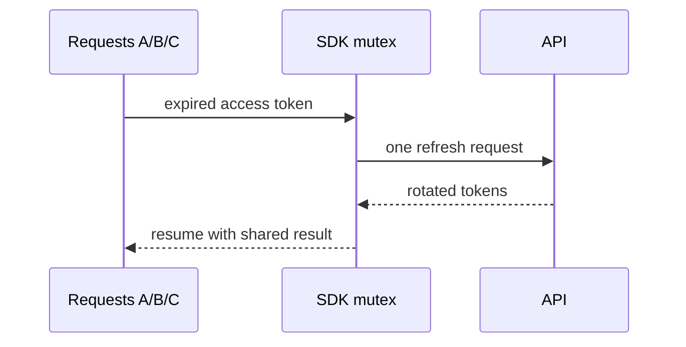
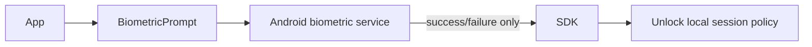

# High-level design

## Goals and boundaries

The system centralizes registration, password login, OTP verification, short-lived access tokens, refresh rotation, device-protected persistence, biometric gating, and logout. It does not provide identity proofing, certificate issuance, SMS delivery, fraud scoring, or guaranteed hardware-backed keys.

Deployment is a containerized API plus PostgreSQL; the Android app reaches it over REST. Trust boundaries are the host app/SDK, device OS/Keystore, network/TLS edge, API, and database. Horizontal production scaling requires shared rate-limit state and revocation state.
