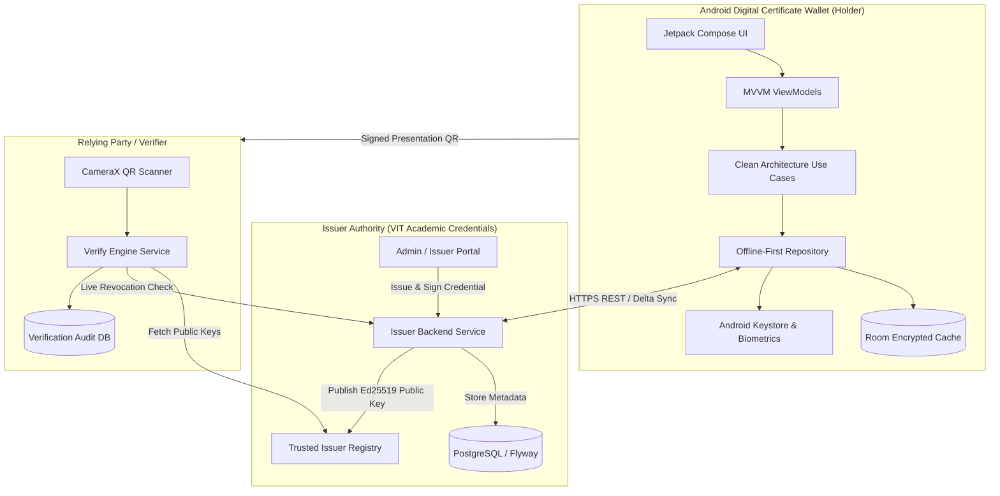
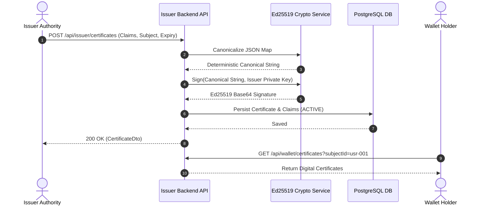
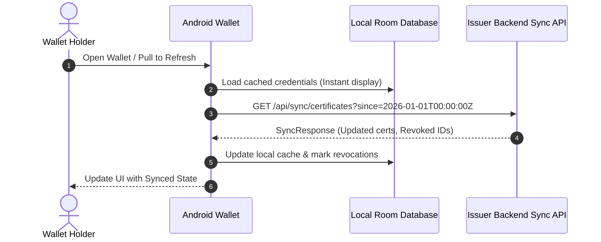
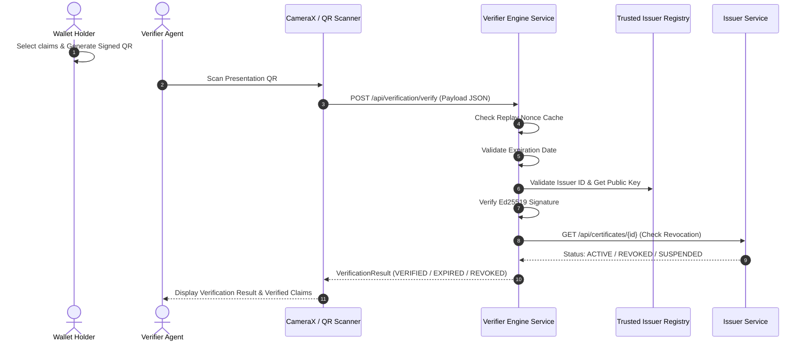
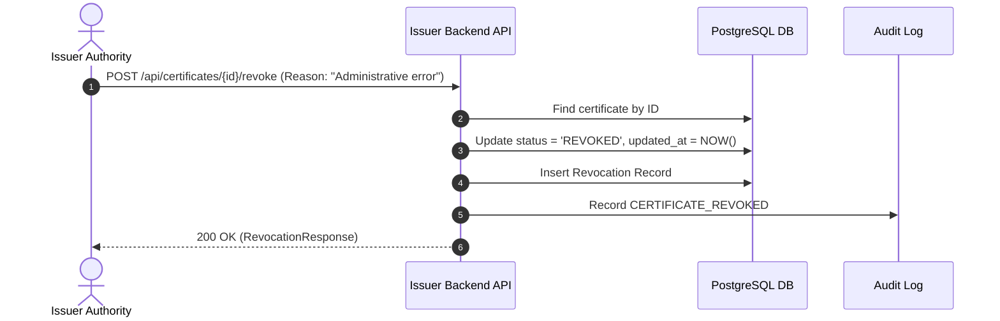

# High-Level Design (HLD) — Secure Digital Certificate Wallet

## 1. Business Problem & System Context
Organizations, educational institutions, and enterprises issue credentials that are traditionally easily forged, hard to verify in real-time, and difficult to share with minimal privacy leakage. 

The **Secure Digital Certificate Wallet** system provides a verifiable digital identity architecture composed of three main actors:
1. **Issuer (Certificate Authority / University / Employer)**: Issues, cryptographically signs with Ed25519, and manages the lifecycle (issuance, revocation, suspension) of digital certificates.
2. **Holder (Wallet User)**: Stores certificates locally in an encrypted Room database protected by Android Keystore and BiometricPrompt, presenting selective disclosure claims via dynamic QR codes.
3. **Verifier (Relying Party / Employer)**: Scans QR presentation payloads, cryptographically validates digital signatures against trusted issuer public keys, verifies non-expiration, verifies live revocation status, and checks replay protections.

---

## 2. High-Level Architecture

---

## 3. Sequence Diagrams

### 3.1 Certificate Issuance Flow

### 3.2 Wallet Synchronization Flow

### 3.3 QR Verification Flow

### 3.4 Certificate Revocation Flow

