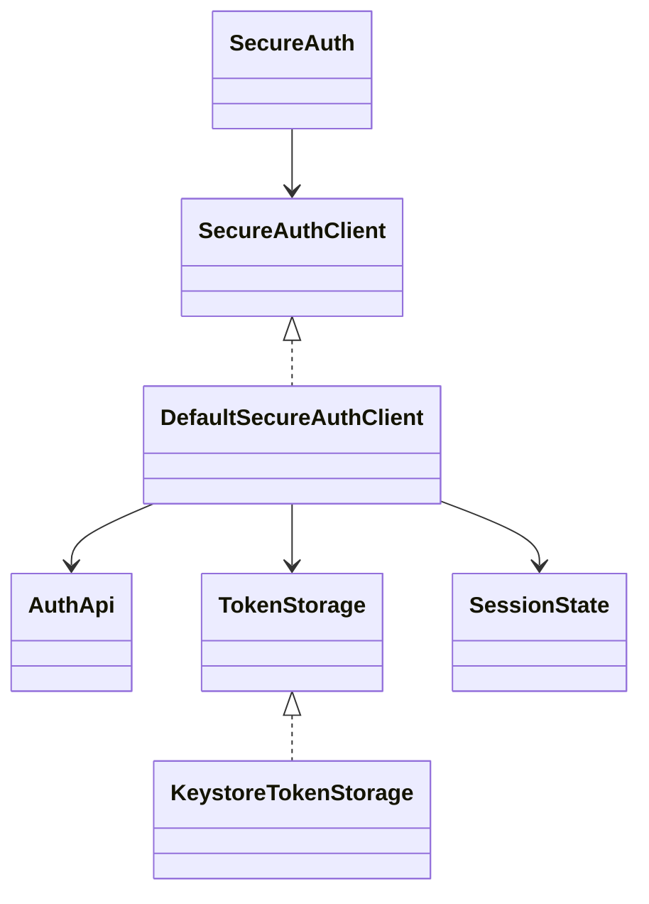
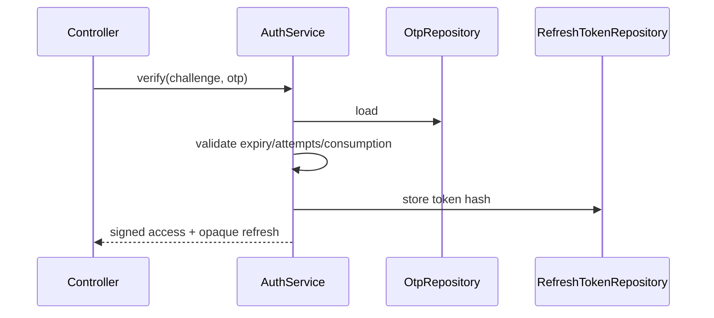

# Low-level design

`SecureAuth` is the stable factory; consumers see immutable API models and `StateFlow`, not Retrofit DTOs. `DefaultSecureAuthClient` owns transitions, maps transport failures, and serializes refresh with a coroutine `Mutex`. `AuthApi` is the remote boundary. `KeystoreTokenStorage` AES-GCM-encrypts a token envelope with a non-exportable Android Keystore key and destroys ciphertext/key on logout or corruption. `BiometricAuthenticator` maps platform callbacks without handling biometric data.

The backend controller accepts validated DTOs and delegates transaction boundaries to `AuthService`. `BCryptPasswordEncoder` hashes passwords and OTP values; `JwtService` signs and verifies access JWTs. Refresh tokens are random opaque values stored only as SHA-256 hashes and rotated on use. JPA repositories own persistence, `RateLimiter` provides local fixed-window throttling, `RequestIdFilter` propagates correlation IDs, and `ErrorHandler` emits stable safe errors.

