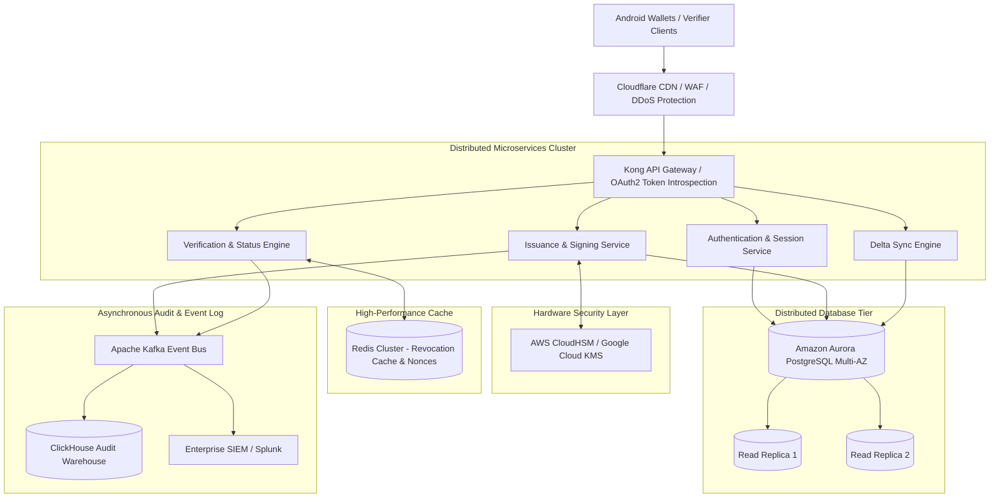

# System Design & Scalability — Secure Digital Certificate Wallet

## 1. Production Architecture Evolution

While the portfolio prototype provides a complete local trust environment with Spring Boot, PostgreSQL, and Android, an enterprise digital certificate platform (such as VIDA's production infrastructure) evolves into a high-throughput, fault-tolerant distributed system.

